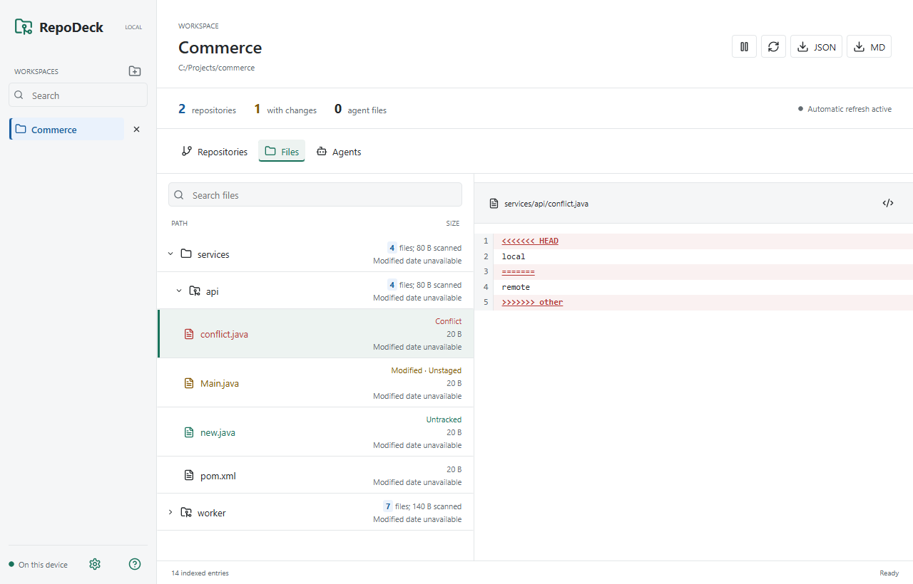

# RepoDeck

**One place to see the Git repositories, files and agent configuration across your projects.**

RepoDeck is a local-first desktop app for developers working across multiple
projects and AI coding agents. Add a folder to discover its repositories, or add
a single checkout. Your projects stay on your machine.

[Downloads](https://github.com/pulkitchandra1997/RepoDeck/releases) |
[Getting Started](#getting-started) |
[Contributing](CONTRIBUTING.md) |
[Development Guide](DEVELOPMENT.md)

*Actual RepoDeck UI with synthetic demo data. Screenshot uses browser fixture IPC;
it is not evidence of native installer testing.*

## Downloads and Version

**Current source version: 0.1.0. No public installer release yet.**

Installers will be published in [GitHub Releases](https://github.com/pulkitchandra1997/RepoDeck/releases),
with a version, source commit, release notes and SHA-256 checksums. CI build
artifacts are development evidence, not a stable release.

| Platform | Installer | Status |
| --- | --- | --- |
| Windows x64 | `.exe` setup | Release verification pending |
| macOS Apple Silicon (M-series) | ARM64 `.dmg` | Release verification pending |
| macOS Intel | x64 `.dmg` | Release verification pending |

There is no automatic updater yet. Unsigned development builds may trigger OS
warnings; do not disable operating-system security controls. Supported OS versions
and installation behavior must be verified before a public release is advertised.

## What You Can Do

- **See multiple repositories together:** branches, changed files, conflicts and
  nested checkouts in one workspace.
- **Browse all project files:** Git repositories and ordinary folders, with
  numbered text previews and color-coded changes.
- **Find the right project:** workspace/repository search, custom aliases and
  language hints from project files.
- **Inspect agent configuration:** discover agent files alongside the code they describe.
- **Review Git settings:** inspect configuration, hooks, LFS and ignore rules.
- **Keep a local record:** export workspace reports as Markdown or JSON.

RepoDeck is an inspection and organization tool, not a replacement for every Git
command. It does not execute discovered agent instructions or resolve conflicts for you.

## Getting Started

1. Install a published build when available, or follow the [development guide](DEVELOPMENT.md).
2. Use the folder button beside **Workspaces** to select a project folder or Git checkout.
3. Switch between **Repositories**, **Files** and **Agents** to inspect the workspace.

Want safe sample projects? Run `npm run fixtures:create` from a development checkout.
See [the test workspace guide](docs/testing/manual-workspace.md) for the generated layout.

## Privacy and Limitations

Core functionality runs locally without a RepoDeck cloud account. Custom names and
preferences are saved in local application settings, not inside your repositories.
Public and private checkouts are inspected using your installed Git; authentication
remains managed by Git and its credential helpers.

Open trusted local repositories only. Git must support `git --no-lazy-fetch --version`.
Comparisons requiring content filters, including LFS, are currently blocked rather
than executed. Inspect submodule working-file changes in the submodule's own entry.
See [security boundaries](SECURITY.md) and [known verification gaps](docs/planning/v1-verification.md).

Optional team/cloud collaboration is planned for v2; it is not available today.

## Contribute

RepoDeck is AI-assisted and human-maintained. Bug reports, reproducible test cases,
documentation and focused pull requests are welcome.

- [Contributor guide](CONTRIBUTING.md)
- [Agent instructions](AGENTS.md) and [AI contribution policy](docs/agents/ai-contribution-policy.md)
- [Product requirements](docs/product/requirements.md) and [architecture](docs/architecture/architecture.md)
- [Release process](docs/releases/release-guide.md)

Source code is licensed under [MIT](LICENSE). Third-party dependencies retain their own licenses.
